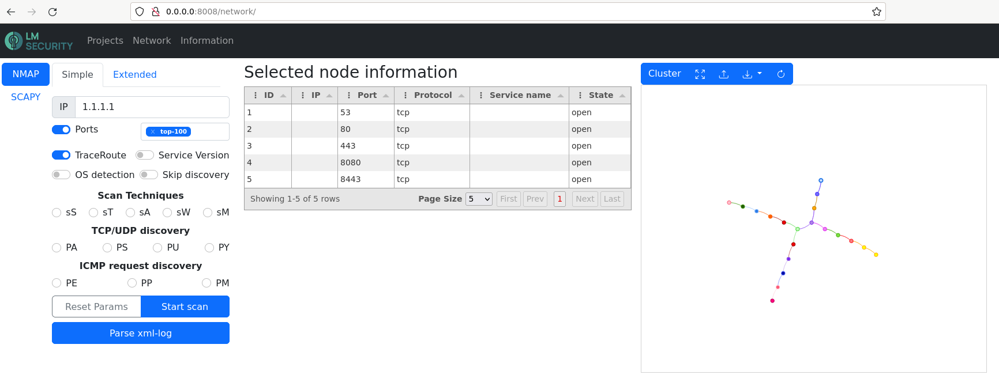
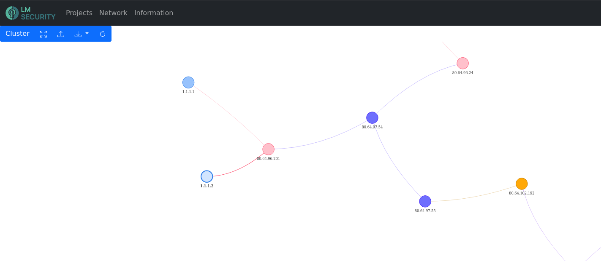
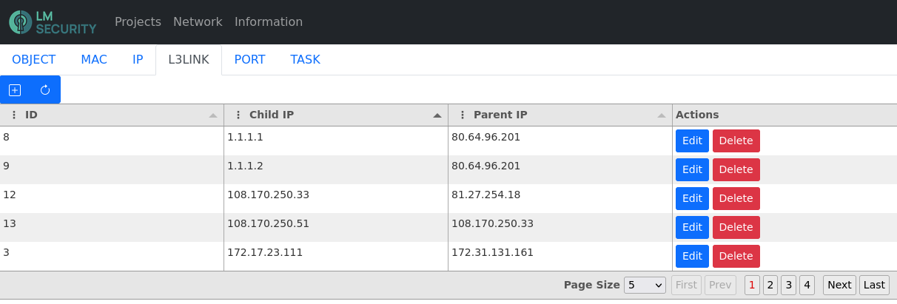
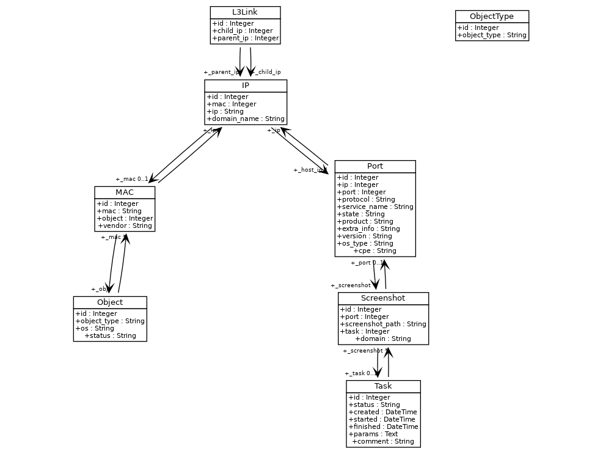

# **Setezor**

### Table of contents
[Desctiprion](#description)

[Features](#features)

[Requirements](#requirements)

[Usage](#usage)

[Database schema](#database-schema)

[Features in new version](#features-in-new-version)

### Screenshots





### Description
**Setezor** - сетевой анализатор трафика с возможностью автоматического построения топологии сети. 

### Features
1. **Разделение на проекты**. Чтобы "не держать все яйца в одной корзинке" реализовано разделение на проекты. Определение принадлежности пользователя к проекту осуществляется через cookie. Пока у пользователя нет cookie, он не может начать работу с проектом.
1. **Активное сканирование с использованием nmap**. Произведена интеграция с нативно установленным `nmap`. На данный момент из результатов сканирования вытягиваются:
    - информация о хосте (IP, MAC, hostname);
    - сведения о трассировке;
    - сведения об порта (номер порта, состояние, сведения о ПО на порту).
1. **Активное сканирование с использованием masscan**. Произведена интеграция с нативно установленным `masscan`.
1. **Парсинг xml-логов сканирования nmap**. Провели сканирование на удаленной машине и хотите загрузить логи в проект? Не проблема, `Setezor` поддерживает парсинг xml-логов `nmap`
1. **Парсинг xml/list/json-логов сканирования masscan**.
1. **Пассивное сканирование с использованием scapy**. Scapy - мощный инструмент для работы с сетью. Приложение создает асинхронный сниффер и налету "потрошит пакеты". Сейчас можно получить информацию из следующих типо пакетов:
    - ARP;
    - LLNMR;
    - NBNS;
    - TCP.
1. **Парсинг pcap-файлов**. Сделали сниффиинг пакетов и хотите загрузить данные в проект? Не проблема, `Setezor` поддерживает парсинг pcap-файлов.
1. **Получение информации организовано в виде задач**. Все сканирования парсиг логов организовано в виде задач и выполняется на стороне сервера в отдельных планировщиках. Есть возможность настроить каждый планировщик индивидуально с целью контороля исходящего траффика.
1. **Построение топологии сети**. На основе данных о сканированиях автоматический строится топология сети со следующими функциями:
    - автоматическое перестроение карты сети при получении новых данных;
    - интерактивная карта сети с возможностью работы в полноэкранном режиме;
    - получение данных об открытых портах по выделенному узлу сети;
    - возможность установить роль узла сети и установить иконку;
    - объединение узлов сети в кластер по 24 маске. Очень удобно, когда на карте 100500 узлов;
    - экспорт топологии сети в `SVG`, `PNG` и `JSON` (структура данных vis.js);
    - импорт топологии сети из `JSON` (структура данных vis.js);
1. **Уведомления**. При изменении статуса задачи всплывает уведомление, информирующее пользователя
1. **Работа с базой через веб-интерфейс**. В веб-интерфейсе есть элемент для работы с базой, поддерживающий следующий функционал:
    - отображение записи;
    - создание записи;
    - редактирование записи;
    - удаление записи.
1. **Использование REST API**. Для работы с серверной частью используется REST API, поэтому есть возможность написать свой интерфейс (tui, gui native, mobile) или интегрировать в свой проект.

### Requirements
#### Software requirements
1. python3.11
1. nmap
2. masscan
3. libpcap2-bin
4. python3-pip

#### Packages requirements

```
aiohttp==3.8.4
aiohttp_jinja2==1.5
aiohttp_session==2.11.0
aiojobs==1.1.0
alembic==1.9.2
cryptography==3.4.8
iptools==0.7.0
Jinja2==3.1.2
mac_vendor_lookup==0.1.12
nest-asyncio==1.5.6
pandas==2.0.0
scapy==2.4.5
setuptools==59.6.0
SQLAlchemy==1.4.32
sqlalchemy_schemadisplay==1.3
xmltodict==0.12.0
xlsxwriter==3.0.8
cffi
click
colorama
openpyxl
```
### Usage
#### From github repo
1. Склонировать репозиторий с github 
```bash
git clone https://github.com/lmsecure/Setezor.git
cd Setezor
```
2. Установить необходимое ПО
```bash
sudo apt install nmap python3.11
```
2.1. Рекомендуется использовать `venv`
```bash
sudo apt install -y python3-venv
python3 -m venv venv
source venv/bin/activate
```
3. Установить зависимые пакеты. 
```bash
pip3 install -r requirements.txt
```
4. Выдать права на работу с сокетами для `nmap` и `python3.11`
```bash
sudo setcap cap_net_raw=eip "$(readlink -f `which venv/bin/python3.11`)"
sudo setcap cap_net_raw,cap_net_admin,cap_net_bind_service+eip `which nmap`
```
5. Запустить приложение
```bash
python3 app.py
```
#### From github pyz-file from last release
1. Скачать файл релиза с github 
```bash
wget https://github.com/lmsecure/Setezor/releases/download/v0.4a/app-v0.4a.pyz
cd Setezor
```
2. Установить необходимое ПО
```bash
sudo apt install nmap python3.11
```

#### From dockerhub image
1. Скачать docker образ
```bash
docker pull docker pull lmsecure/setezor
```
2. Создать рабочую папку. Она будет нужна для хранения логов и пользовательских данных
```bash
mkdir ~/setezor && cd $_
```
3. Запустить docker контейнер
```bash
docker run -p 16661:16661 --network host -v ~/setezor/projects:/setezor/projects -v ~/setezor/logs:/setezor/logs -d lmsecure/setezor:latest
```
После запуска перейти `http://localhost:16661`


### Database schema


### Features in new version
1. Возможность скармливать логи других инструментов:
    - whatweb
    - crackmapexec
    - nikto
    - gobuster
    - и другие
1. Расширенный анализ nmap сканирования
1. Увеличить количество типов анализуруемых пакетов и качество парсинга пакетов
1. Работа с доменными именами
1. Поиск сервисов по dns записям и субдоменам
1. Создание скриншотов веб-приложений
1. Проксирование запросов

